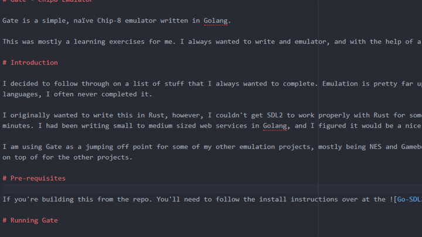

# Gate - Chip8 Emulator

Gate is a simple, naïve Chip-8 emulator written in Golang.

This was mostly a learning exercises for me. I always wanted to write and emulator, and with the help of a lot of online resources I think I got pretty far.



# Introduction

I decided to follow through on a list of stuff that I always wanted to complete. Emulation is pretty far up on the list. While I have messed around in emulators before in other languages, I often never completed it.

I originally wanted to write this in Rust, however, I couldn't get SDL2 to work properly with Rust for some reason. The golang SDL2 was super simple to setup and I was up and running in minutes. I had been writing small to medium sized web services in Golang, and I figured it would be a nice language to implement some emulators in.

I am using Gate as a jumping off point for some of my other emulation projects, mostly being NES and Gameboy. I used this Chip8 emulator to build out a small framework that I can build on top of for the other projects.

# Pre-requisites

If you're building this from the repo. You'll need to follow the install instructions over at the .

# Running Gate

Gate can be run from the command line using the command

```bash
gate "roms/invaders.c8"
```

# Resources

I spent a lot of time reading through several documentations and following along with both a C++/Golang implementation of the Chip-8 instruction set. There were a couple instructions where I needed to copy across code because I couldn't get it to work, ie the drawing.

## Documentation

1. "Chip-8 - Wikipedia" - 
2. "Emulator101.com - Chip-8 Sprites" 
3. "Writing a Chip-8 Emulator" - 
4. "How to write an emulator (CHIP-8 interpreter) | Multigesture.net" - 
5. "Cowgod's Chip-8 Technical Reference" - 

## Repo

Here are the repo's I also looked over.

1. 
